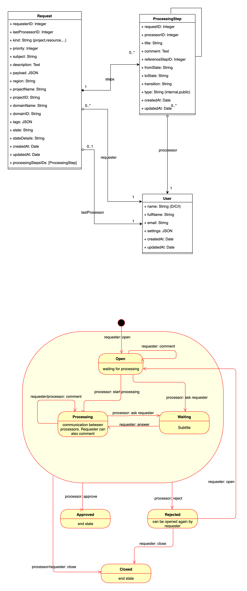

# Mercury - The Request API

Mercury API enables approval processes to be decoupled and managed outside of the consumer app.

The interaction with the Mercury service is done entirely via API. The API requires an Openstack Authentication Token and region in which the token was issued. Both are transmitted to the service via headers.

A request is initially created by a user with the state open. Then further actions can be made depending on the roles of the user and the state (see class diagram).

A request is considered completed when the status closed, approved or rejected is reached.

## API

Mercury is based on the GraphQl and offers not only the Quries and Mutations but also Subscriptions for live updates.

[Type Defs](https://github.com/sapcc/juno/tree/main/apis/mercury/src/graphql/typeDefs.js)

## Architecture

