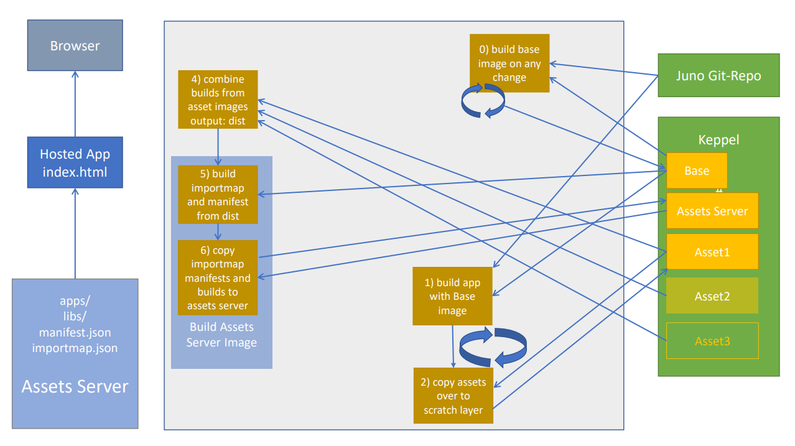

# Pipeline

## qa-de-1

- juno.qa-de-1.cloud.sap -> dashboard
- exampleapp.juno.qa-de-1.cloud.sap -> exampleapp
- assets.juno.qa-de-1.cloud.sap -> assets server (qa)
- ui.juno.qa-de-1.cloud.sap -> storybook

## s-eu-nl-1

- juno.eu-nl-1.cloud.sap -> dashboard
- exampleapp.juno.eu-nl-1.cloud.sap -> exampleapp
- ui.juno.eu-nl-1.cloud.sap -> storybook

## global

- juno -> s-eu-nl-1 -> juno
- exampleapp -> s-eu-nl-1 -> exampleapp
- ui -> s-eu-nl-1 -> ui
- assets -> anycast IP (A Record) HA Setup


Overview how the assets are build

## Base image

We use the base image to run scripts such as the as script to generate the importmap and to cache node modules. This image is created on every change in juno repo. It contains important libs like rsync and jq and npms like the jspm generator.

This image is used as the basis for creating images for individual apps and libs as well as for the assets server image.

## Asset image

The asset image uses base image to build the assets. Finally, the finished build is placed under `/dist/build`. You can also find `package.json` under `/dist`. The `package.json` is used according to the **Single source of truth - policy** when building the assets server image for generating the importmap and the manifest.

| :exclamation: This is very important |
| ------------------------------------ |

- packages with missing **build** script will be ignored!
- **source** and **module** are mandatory in package.json.
- only the packages listed in **peerDependencies** are taken into account when generating the importmap.
- tests are run if the corresponding **test** script is present in package.json.

## Assets server image

Assets server image is responsible for serving app and lib builds as well as static assets. It also provides the manifest and the importmap. We use nginx as web server.

When building the image, the base image is used as the basis and the asset builds (result of the asset image) are the input.

With the help of the scripts from the base image **generate_importmap** and **generate_manifest**, the corresponding files are created and stored under the html root. The following example should clarify what the input looks like:

- /libs/juno-ui-components/
  - build/
  - package.json
- /apps/whois/
  - build/
  - package.json

Based on the example above, the following file structure is generated using the package.json files:

- /libs/juno-ui-components@1.0.0
- /libs/juno-ui-components@latest
- /apps/whois@1.0.0
- /apps/whois@latest
- /manifest.json
- /importmap.json

| :memo: | old versions are carried over from the previous image, new versions are added and latest are overwritten. |
| ------ | :-------------------------------------------------------------------------------------------------------- |

## Importmap

Generate test data

```js
node scripts/generate_test_data.js
```

Importmap is generated using generator from https://jspm.org. Where internal libs like juno-ui-components are properly linked to the assets server. In addition, internal libs are linked under imports @juno. Example:

```json
{
  "imports": {
    "@juno/juno-ui-components@latest/": "ASSETS_SERVER_ENDPOINT/libs/juno-ui-components@latest/build/",
    "@juno/juno-ui-components@latest": "ASSETS_SERVER_ENDPOINT/libs/juno-ui-components@latest/build/index.js"
  },
  "scopes": {
    "ASSETS_SERVER_ENDPOINT/apps/whois@latest/": {
      "juno-ui-components@latest/": "ASSETS_SERVER_ENDPOINT/libs/juno-ui-components@latest/build/",
      "juno-ui-components@latest": "ASSETS_SERVER_ENDPOINT/libs/juno-ui-components@latest/build/index.js"
    }
  }
}
```

### Ignore external dependencies

In the case that the CDN server is not reachable, the generation of the importmap should not include dependencies from that CDN.
There are two places where using the external CDN libs is turned off.

ci/Dockerfile.asset -> IGNORE_EXTERNALS=true
ci/Dockerfile.assets.server -> --ignore-externals=true

## Manifest

Manifest serves mainly as input for the widget-loader and secondarily as an overview of the available libs and apps.

It has the following structure:

```json
{
  "juno-ui-components@1.0.0": {
    "type": "lib",
    "url": "ASSETS_SERVER_ENDPOINT/libs/juno-ui-components@1.0.0",
    "updatedAt": Date.now()
  },
  "whois@latest": {
    "type": "app",
    "url": "ASSETS_SERVER_ENDPOINT/apps/whois@latest/build/index.js",
    "updatedAt": Date.now()
  }
}
```
